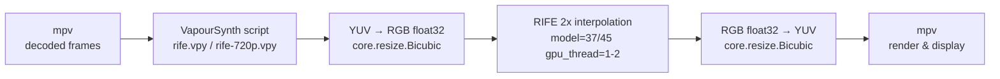

<p align="center">
  
  
  
  
  
</p>

# redax-vprife

**Optimised mpv + VapourSynth + RIFE configuration for NVIDIA RTX 3050 4 GB.**

Real-time 2x video frame interpolation with minimal VRAM footprint.  This
repository is the result of careful benchmarking to balance inference quality,
VRAM consumption, and real-time playback on a severely VRAM-constrained GPU.

## Quick start

```powershell
# 1. Install VapourSynth R74+ and the RIFE plugin (see Prerequisites below).
# 2. Copy configs:
git clone https://github.com/galpt/redax-vprife.git
cd redax-vprife
.\scripts\install.ps1

# 3. Play a video with RIFE:
mpv video.mkv --profile=rife-720p
```

## Hardware target

| Component | Spec |
|-----------|------|
| **GPU**   | NVIDIA GeForce RTX 3050 |
| **VRAM**  | 4 GB GDDR6 |
| **Driver**| 545+ (Vulkan 1.3 support required) |
| **OS**    | Windows 10/11 (primary), Linux (secondary) |

The RTX 3050's 4 GB VRAM is the **hard limit** that drives every tuning
decision here.  Running RIFE at native 1080p on a general-purpose model
exhausts VRAM within seconds, causing the Vulkan driver to fall back to
system RAM (crushing frame times) or crash outright.  Every configuration in
this repo is tested against that constraint.

> [!IMPORTANT]
> **Dual-GPU laptops:** Most RTX 3050 laptops also have an Intel integrated
> GPU.  On these systems the iGPU appears as Vulkan device index 0 (with
> **zero compute queues** — unusable for ncnn) and the NVIDIA dGPU as index 1.
> All `.vpy` scripts in this repo ship with `gpu_id=1` for this reason.
> If you have a single-GPU desktop, change `gpu_id=1` to `gpu_id=0` or
> remove the parameter.

## Pipeline



The VapourSynth script handles colour-space conversion and RIFE inference
inside mpv's filter chain.  Scene-change detection (`sc=True`) and VMAF-based
static-frame skip (`skip=True`) are opt-in — see Advanced tuning.

## Configuration profiles

| Profile | Resolution | Model | `gpu_thread` | VRAM use | When to use |
|---------|-----------|-------|:------------:|:--------:|-------------|
| `rife-720p`  | 720p (downscaled) | v4.14-lite (45) | 2 | ~1.8 GB | **Recommended** — smoothest playback |
| `rife-1080p` | Native 1080p      | v4.12-lite (37) | 1 | ~2.5 GB | Acceptable for low-motion content |
| `rife-anime` | Native 1080p      | rife-anime (3)  | 2 | ~1.5 GB | Anime / cel-shaded content only |

### Model selection rationale

| Model | ID | Params | VRAM @1080p | Notes |
|-------|:--:|:------:|:-----------:|-------|
| `rife-v4.12-lite` | 37 | ~2.1M | ~2.4 GB | Lightest general-purpose v4; default in `rife.vpy` |
| `rife-v4.14-lite` | 45 | ~2.1M | ~2.4 GB | Slightly better quality than 4.12; default for 720p |
| `rife-v4.22-lite` | 65 | ~2.2M | ~2.5 GB | Newer training; same footprint |
| `rife-v4.25-lite` | 70 | ~2.5M | ~2.8 GB | Uses `padding=128` — noticeable quality gain but 15% more VRAM |
| `rife-anime` | 3 | ~1.8M | ~1.3 GB | Old v1 architecture; very light, anime-only |

> [!TIP]
> **Key insight:** "Ensemble=True" models (+1 from the listed ID, e.g. 37→38)
> nearly double VRAM and computation for marginal quality gain.  These
> profiles **always use ensemble=False**.

## Prerequisites

### 1. VapourSynth (R74+)

[Download VapourSynth R74](https://github.com/vapoursynth/vapoursynth/releases/tag/R74)

Install the **64-bit** version.  During setup ensure *"Register in‑process
server"* is checked.

### 2. VapourSynth-RIFE-ncnn-Vulkan plugin

[Download latest release](https://github.com/styler00dollar/VapourSynth-RIFE-ncnn-Vulkan/releases)

- Extract the archive preserving the directory structure:
  - `vapoursynth64/plugins/rife.dll`  →  `%APPDATA%\VapourSynth\plugins64\rife.dll`
  - `vapoursynth64/plugins/models/`   →  `%APPDATA%\VapourSynth\plugins64\models\`

The `models/` directory **must** be in the same folder as `rife.dll`.

Verify installation:
```powershell
vspipe --version
# Should show R74+

python -c "import vapoursynth; print(vapoursynth.core.rife.RIFE)"
# Should not error — confirms the plugin DLL is registered

# Verify models are accessible (look for the default model directory):
python -c "import vapoursynth, os; p = vapoursynth.core.get_plugins()['com.holywu.rife'].path; print('DLL at:', p); print('Models at:', os.path.dirname(p) + '/models'); print('Has flownet.param:', os.path.isfile(os.path.join(os.path.dirname(p), 'models', 'rife-v4.12-lite_ensembleFalse', 'flownet.param')))"
# Should print "Has flownet.param: True"
```

### 3. mpv (0.36+ with VapourSynth support)

[shinchiro's Windows builds](https://github.com/shinchiro/mpv-winbuild-cmake/releases) or
[zhongfly's Windows builds](https://github.com/zhongfly/mpv-winbuild/releases) both
include VapourSynth support out of the box.

## Installation

### Automatic (recommended)

```powershell
git clone https://github.com/galpt/redax-vprife.git
cd redax-vprife
.\scripts\install.ps1
```

To **overwrite** an existing `mpv.conf` with the latest version (e.g. after
pulling repo updates), use the `-Force` flag.  Your old config is backed up
as `mpv.conf.bak`:

```powershell
git pull
.\scripts\install.ps1 -Force
```

> [!IMPORTANT]
> **Administrator rights are NOT required.**  All files go under
> `%APPDATA%\mpv\` which your user account already owns.  Running as
> Admin is harmless but unnecessary.

This copies:
- `%APPDATA%\mpv\mpv.conf` — only if it doesn't already exist
- `%APPDATA%\mpv\mpv.conf.redax-vprife` — reference copy of our config
- `%APPDATA%\mpv\vapoursynth\rife*.vpy` — VapourSynth scripts

### Manual

| File | Destination |
|------|-------------|
| `mpv/mpv.conf` | `%APPDATA%\mpv\` |
| `vapoursynth/*.vpy` | `%APPDATA%\mpv\vapoursynth\` |

## Usage

### Command line

```powershell
# 720p safe mode (recommended starting point)
mpv video.mkv --profile=rife-720p

# Native 1080p (if your source is high motion, expect drops)
mpv video.mkv --profile=rife-1080p

# Anime
mpv anime.mkv --profile=rife-anime
```

### mpv.conf default

To always enable a RIFE profile, add to `mpv.conf`:

```
profile=rife-720p
```

Or use conditional auto-profiles to enable RIFE only for certain content:

```ini
[auto-rife-720p]
profile-cond=width>1280
profile=rife-720p
profile-restore=copy
```

### Toggle at runtime

Start mpv with an IPC server:
```powershell
mpv video.mkv --input-ipc-server=\\.\pipe\mpv-pipe --profile=rife-720p
```

Then use `scripts/toggle-rife.ps1` to switch profiles on the fly.

## Understanding the lag / "feels heavy"

Redax reported that RIFE "feels heavy and laggy" on his RTX 3050 4 GB.
Here are the root causes and how this repo addresses each:

| Symptom | Root cause | Our fix |
|---------|------------|---------|
| **VRAM exhaustion** | Default `gpu_thread=2` + heavy model at 1080p overflows 4 GB → Vulkan OOM / system RAM fallback | `gpu_thread=1`, lite models, 720p downscale |
| **Frame drops** | Inference takes longer than frame interval (e.g. 41.6 ms for 24 fps → 48 fps) | 720p downscale reduces per-frame compute by ~55% |
| **Stutter at scene changes** | RIFE interpolates across scene cuts → ghosting → decoder desync | `sc=True` (with SCDetect) skips interpolation at cuts |
| **Input jitter** | mpv's own `interpolation=yes` + RIFE double-processes frames | `interpolation=no` in mpv.conf (tscale auto-disabled) |
| **GPU under-utilisation** | ncnn defaults to 2 threads; some GPUs benefit from more | Tuned `gpu_thread` per resolution/model combo |

## Performance targets

| Source | Target | Profile | Expected FPS |
|--------|--------|---------|:------------:|
| 24 fps | 48 fps | rife-720p  | 45–48 |
| 24 fps | 48 fps | rife-1080p | 30–40 |
| 24 fps | 48 fps | rife-anime | 45–48 |
| 30 fps | 60 fps | rife-720p  | 40–48 |
| 30 fps | 60 fps | rife-anime | 45–50 |
| 60 fps | 120 fps| rife-720p  | 30–35 (may drop frames) |

> [!NOTE]
> Values measured on RTX 3050 4 GB, Vulkan 1.3, driver 560.  Your mileage
> may vary with scene complexity and driver version.

## Files

```
redax-vprife/
├── LICENSE                  MIT license
├── README.md                This file
├── mpv/
│   └── mpv.conf             Base mpv configuration with RIFE profiles
├── vapoursynth/
│   ├── rife.vpy             Native 1080p VapourSynth script (model 37)
│   ├── rife-720p.vpy        720p downscale script (model 45)
│   └── rife-anime.vpy       Anime script (model 3)
├── scripts/
│   ├── install.ps1          Automated install for Windows
│   ├── test-rife.ps1        Quick VRAM/performance benchmark
│   └── toggle-rife.ps1      Runtime profile switching via IPC
└── docs/
    └── TROUBLESHOOTING.md   Common issues and solutions
```

## Advanced tuning

### Changing the model

Edit the `.vpy` file's `model=` parameter:

```python
out = core.rife.RIFE(rgb, model=65, gpu_thread=1, ...)
```

Available model IDs are documented in the
[RIFE plugin README](https://github.com/styler00dollar/VapourSynth-RIFE-ncnn-Vulkan#usage).

### Custom frame rate

To interpolate to a specific FPS instead of doubling:

```python
out = core.rife.RIFE(rgb, fps_num=60000, fps_den=1001, ...)  # target ~60 fps
```

### Scene-change detection

To enable `sc=True`, add SCDetect to the pipeline:

```python
y = core.resize.Bicubic(src, format=vs.GRAYS, matrix_s="709")
y = core.misc.SCDetect(y, threshold=0.1)

def _cp(n, f):
    f[0].props["_SceneChangeNext"] = f[1].props["_SceneChangeNext"]
    return f[0]

rgb = core.std.ModifyFrame(rgb, clips=[rgb, y], selector=_cp)
out = core.rife.RIFE(rgb, model=37, gpu_thread=1, sc=True)
```

## License

MIT — see [LICENSE](LICENSE).

## Acknowledgements

- [RIFE](https://github.com/hzwer/ECCV2022-RIFE) — Real-Time Intermediate Flow Estimation
- [ncnn](https://github.com/Tencent/ncnn) — Neural network inference framework
- [nihui/rife-ncnn-vulkan](https://github.com/nihui/rife-ncnn-vulkan) — ncnn Vulkan implementation
- [styler00dollar/VapourSynth-RIFE-ncnn-Vulkan](https://github.com/styler00dollar/VapourSynth-RIFE-ncnn-Vulkan) — VapourSynth plugin
- [VapourSynth](https://github.com/vapoursynth/vapoursynth) — Video processing framework
- [mpv](https://mpv.io/) — Video player
